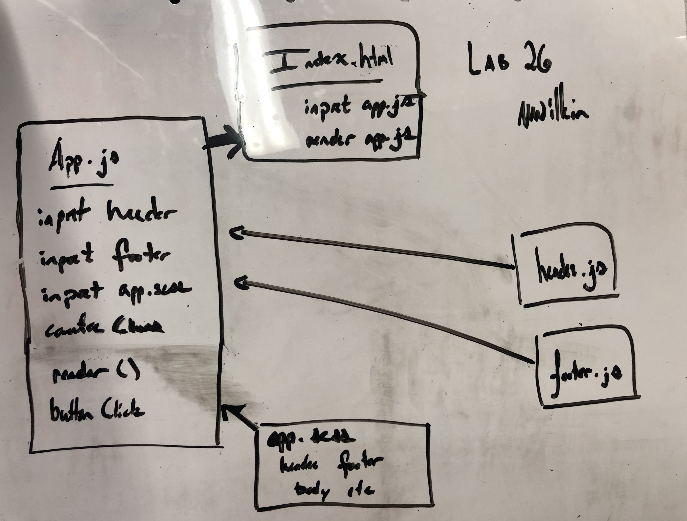

# LAB - Class 26

## Component Based UI

Create and style a counter application using React components.

### Author: Matt Wilkin

### Links and Resources

- [submission PR](https://codesandbox.io/s/wilkinlab26-c2tqr)

- UML 

### Modules

header.js

footer.js

app.scss

Counter class
